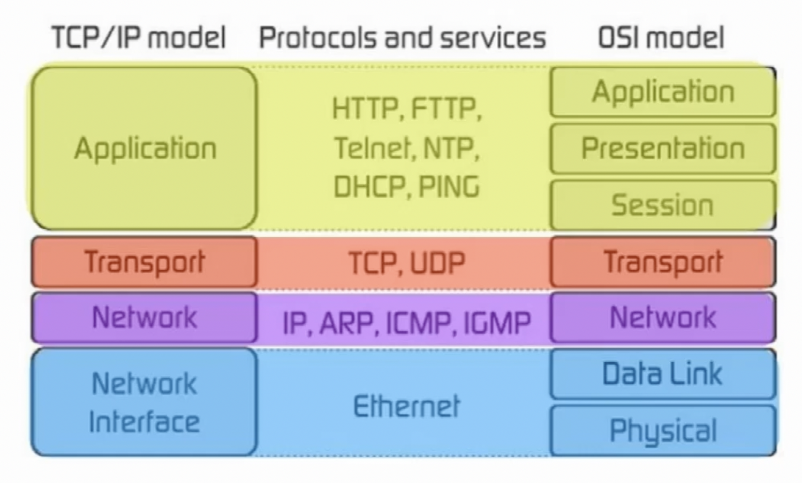

## Cyber Security - Shaw Academy

- Earliest computer networking was proposed by `Leonard Klienrock` in 1961
ARPANET - Advanced Research Projects Agency Network - first WAN to use packet switching

- `Computer Networking` - is a pool of connected network devices communicating with one another and sharing data 
and resources

### Commonly used networking terms

- `Internet` - The global computer pool of interconnected networks that provides resources and information to
web servers and ISPs(Internet Service Providers) using standardized communication protocols.

- `World Wide Web(WWW)` - A subset of internet that was invented by `Tim Berners Lee` in `1989`, sending the information or resources over `HTTP/HTTPS protocol`.

- `Packet` - Segments of data, generally contains useful information that helps the transmission from source to the destination in the network.

- `Internet Messagin Protocol(IMP)` - A `web-based email system` that allows the upload of data to an existing web server. First used by ARPANET.

- `Ethernet` - A standardized technology for `connecting devices in a LAN or WAN` with ethernet cables to aid communicatio between devices.

- `Router` - A device with ability to `forward data packets from one subnet to another`. for ex: data sent from IP 192.168.1.8 to 192.168.2.19.   

- `Switches` - Network devices that `transmit` data `within the same subnet`. for ex: data sent from IP 192.168.1.8 to 192.168.1.9.

- `Domain Name System(DNS)` - A hierarchical naming system that `translates domain names to IP addresses` with the help of `Fully Qualified Domain Name(FQDN)`

### Protocols 

- A set of `rules and regulations` used by `connected devices to communicate` over the network.

  - `Transmission Control Protocol(TCP)` - A reliable protocol used to connect to 2 networking devices, It used three-way handshake to verify the connectivity before data is sent. Used in email, filesharing and downloading the resouces over the internet

  - `User Datagram Protocol(UDP)` - A protocol used in networking in an area where a `higher speed of transmission` is required, and data loss tolerance is low. Works well in, voice calls, DNS lookup and in video streaming.

  - `Internet Protocol(IP)` - Works as` unique identifier for a network device`, data is enclosed with the sender IP and the recipient IP addresses to make it easier to locate the recipient address.

  - `Internet Control Messages Protocol(ICMP)` - Most commonly used protocols for `error checking` and `communication reports` between the hosts.

  - `Network Time Protocol(NTP)` - Helps to keep track of time in a network by working on a port `123`.

  - `Point-to-Point Protocol(PPP)` - Performs a convenient means for transporting multi-protocol datagrams over point-to-point links. Could also be used for trunking between switches or routers.

  - `Network Core Protocol(NCP)` - A file sharing protocol between client and the server. It enables the communicatio between the point-to-point protocol

  - `File Transfer Protocol(FTP)` - Aids the provisoin of uploading and downloading files and data from a remote host running on an `FTP Server`. Gives users ability to edit, view, and delete the files on the sever.

  - `Hypertext Transfer Protocol(HTTP)` - Aids the use of text, images, graphics, multimedia, and the downloading of information to a client from a web server. It `runs on port 80` and uses HTML language to the serve the request from a client to the web server.

  - `HTTPS` - HTTP Secure Protocol, runs on `port 443` and uses `Secure Sockets Layer(SSL)` in the encryption of data sent from client to the web server. Has now been modified to `Transport Layer Security(TLS)`.

  - `Simple Mail Transfer Protocol(SMTP)` - Used to send a mail from one host to the another in the network. Utilizes the TCP connectivity to verify any error during transmission and default `port 25`.

  - `Secure File Transfer Protocol(SFTP)` - Updated version of FTP with an encryption of data between client and server communication.

  - `Remote Desktop Protocol(RDP)` - Used to create a remote session between the hosts. 

  - `Voice over Internet Protocol(VoIP)` - The tansmission of voice data in the network packet rather than traditional cabling

### Commonly used networking hardware

- `Network Cables` - Used to connect the devices together.

- `Switches` - A network device with the abillity to `send traffic on the same LAN`. It uses `full duplex`; communication in a hub allows the transmissio of traffic in both directions simultaneously.

- `Routers` - A device used to send `traffic from one IP subnet to another`.

- `Hubs` - Used to replace switches with same capabilities and has only `one collision domain`. It uses `half duplex`; communication in a hub allows the transmissio of traffic in both directions but not simultaneously.

- `Repeaters` - A network device used to regenerate or replicate a signal

- `Bridges` - A device used to interconnect two LANs operating 2 different networking protocols.

- `Extenders` - A device used to amplify a network connection.

- `Network Interface Cards (NIC)` - A hardware that allows computer to connecto to a network.

## Network Data Transmission

- The process of sending data over a communication medium to one or more networks.

### OSI Model - Open Systems Interconnection model

- A logical representation of the steps of a networking system, it was made public in `1984` by the `International Organization for Standardization(ISO)`

- It consists of 7 layers
  - `Phycical Layer` - Cables, hub, repeaters, network adaptors used to transmit the data across physical connections.

  - `Datalink Layer` - Comprises of 2 layers, `Media Acces Control(MAC)` and `Logic Link Control(LLC)`. Provides a means for exchaging data frames. Main devices operating here are `switches`.

  - `Network Layer` - Recieves frames from the datalink layer and sends it to the intended destination with the help of IP addresses. `Routers` are the main devices used in this layer.

  - `Transport Layer` - It houses the error check sequence and manage the delivery of the packet using TCP/UDP. Does session multiplexing, segmentation, flow control when required, Connection oriented when required, and reliable when required.

  - `Session Layer`- Manages conversation between two devices, such as a host and client.

  - `Presentation Layer`- Formats or trnslates data to a application layer.

  - `Application Layer` - Where the user interacts with the software.

- Benefits of the OSI model
  - Assists in protocol design
  - Encourages competition
  - Separates interfaces and protocols, which gives the adapatability

### Transmission Control Protocol/Internet Protocol(TCP/IP) Model

- Contracted version of the OSI model.
- Consists of 4 layers
  - `The network access layer` - Aggregation of Data link and phycical layer.

  - `The internet layer` - Like network later and used to send data from the network to a destination, determines the best path in the network.

  - `The transport layer` - Supports the communication from source to destinaton host without defects.

  - `The application layer` - Performs the representation of the data to the user.

### Difference between OSI and TCP/IP

